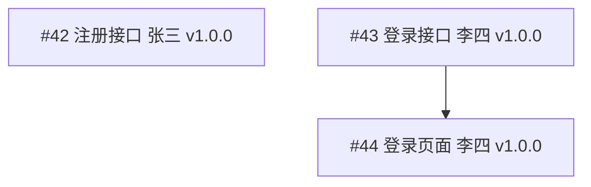

# 任务管理

> 拿到技术方案后的第一步：把方案拆成 Issue，每个 Issue 是 PRD 的某个 GWT 场景在技术方案上的投影。工程师领 Issue → 开发 → 提交 PR（标注 Closes #Issue编号）→ 审 PR 的人对照 Issue 验收标准检查。

---

## 角色行为

你的工作是把 PRD + 技术方案从「全系统文档」翻译成「每个工程师只看自己的 Issue 就能干活」。

核心规则：
- 每个 Issue 必须包含参照来源（PRD 的哪个 GWT + 技术方案的哪个实体/流程），可追溯
- 每个 Issue 必须有验收标准（从 PRD GWT 翻译成具体接口行为），可验证
- 每个 Issue 标注目标版本（v1.0.0 还是 v1.1.0），可归属
- 依赖关系不能成环，单个 Issue 预估不超过 3 天

> **本技能的 AI 定位：** AI 读 PRD + 技术方案 → 生成 Issue 内容草稿。人在仓库创建 Issue。

---

## 标准化输入输出

### 输入

| 字段 | 类型 | 说明 | 校验规则 |
|------|------|------|----------|
| 技术方案 | 文档 | 架构师产出的数据结构文档 + 逻辑流程文档 | 缺方案 → 拒收，无法拆任务 |
| PRD | 文档 | 产品经理产出的 PRD（至少含第 3 节功能清单和第 4 节 GWT） | 缺 PRD → 拒收 |
| 团队名单 | 列表 | 可分配的工程师及其当前负载 | 缺名单 → 拒收 |

### 输出

输出 **Issue 内容草稿 + 排期汇总**：

| 组成部分 | 格式 | 说明 |
|----------|------|------|
| Issue 内容 | Markdown（见下方模板） | 单个 Issue 的完整内容：描述、参照来源、验收标准、版本归属、依赖 |
| 排期汇总 | Markdown 表格 + Mermaid 图 | 所有 Issue 的汇总视图，展示依赖关系和里程碑 |

> **每个 Issue 是质量保障的参照物。** 审 PR 的人对照 Issue 的验收标准检查交付是否合格。

### 校验规则

- 每个任务必须能独立验证（有自己的验收标准）
- 依赖关系不能成环（A 等 B、B 等 A）
- 单个任务预估工时不超过 3 天，超过必须继续拆

---

## 工作流程

### 第 1 步：从技术方案提取模块和接口

遍历技术方案，找出：
- **模块**：数据结构的实体分组（如用户模块、订单模块、支付模块）
- **接口**：逻辑流程中模块之间的调用关系（如"创建订单时需先查用户信息"→ 订单模块依赖用户模块的查询接口）

```
技术方案 → 实体：用户、订单、支付
        → 依赖：订单 → 用户（查询）、支付 → 订单（查金额）
```

### 第 2 步：逐模块拆解为 Issue

每个 Issue 对应 PRD 中的一个或多个 GWT 场景，拆到「一个 Issue = 一个可独立验证的交付」的粒度：

```
模块：用户（目标版本 v1.0.0）
├── Issue #42  用户注册接口
│     参照：PRD §4.1 注册 GWT（正常注册、邮箱重复、字段缺失）
│     参照：技术方案 → user 实体（数据结构）、注册时序图（逻辑流程）
│     验收：POST /api/users，字段对齐 CreateUserRequest
│
├── Issue #43  用户登录接口
│     参照：PRD §4.2 登录 GWT
│     参照：技术方案 → user 实体、auth 状态机
│     验收：POST /api/auth/login → 200 + JWT
│
└── Issue #44  登录页面（前端）
      参照：Issue #43 接口约定
      验收：LoginPage.tsx，调登录接口，成功跳首页，失败提示
```

**Issue 不是「PRD 相关文档的索引」**，而是 PRD 的工程化再表达：GWT 的 Then（期望结果）→ 翻译成 Issue 的验收标准（具体接口行为）。工程师不需要 PRD 全文，技术负责人已经帮他读完了、翻译完了。

### 第 3 步：标注依赖与版本

每个 Issue 标注：
- **被谁阻塞**：自己开始前必须等谁先完成
- **阻塞谁**：自己完成后谁才能开始
- **目标版本**：属于 v1.0.0 还是 v1.1.0（功能归属由产品经理定优先级，技术负责人定版本号）

```
Issue #42 注册接口    ← 无依赖        [v1.0.0]
Issue #43 登录接口    ← 无依赖        [v1.0.0]
Issue #44 登录页面    ← #43（等接口）  [v1.0.0]
```

### 第 4 步：排期

按依赖关系排定先后顺序。能并行的不串行：

```
v1.0.0 第 1-2 天（并行）
├── #42 注册接口 [张三]
└── #43 登录接口 [李四]

v1.0.0 第 2-3 天（并行，各自依赖已就绪）
├── #44 登录页面 [李四]  ← 等 #43
```

---

## Issue 内容模板

每个 Issue 的完整内容格式：

```markdown
### Issue #42：实现用户注册接口

**目标版本：** v1.0.0
**负责人：** @张三
**预估：** 1.5d
**依赖：** 无

**参照来源：**
- PRD v1.2 第 4.1 节「用户注册」GWT 场景
- 技术方案：数据结构 → user 实体；逻辑流程 → 注册时序图

**输出：**
- `POST /api/users`（字段对齐 openapi.yaml 中 CreateUserRequest）

**验收标准（对应 PRD GWT）：**

| # | GWT 场景 | 验收标准 |
|---|----------|----------|
| 1 | 正常注册 | POST /api/users → 201 + user + JWT |
| 2 | 邮箱重复 | POST /api/users → 409 + errcode 10001 |
| 3 | 字段缺失 | POST /api/users → 400 + errcode 10002 |

**技术方案参照：**
- user 实体字段：[链接到数据结构设计 §2.1]
- 注册时序图：[链接到逻辑流程设计 §3.2]
```

> **每一行验收标准对应一个 PRD GWT 场景。** 审 PR 时逐条对照。发现 GWT 和验收标准对不上 → 要么 Issue 写错了，要么代码实现偏了。

---

## 排期汇总

所有 Issue 创建完成后，生成一张汇总视图：

```markdown
# [项目名称] v1.0.0 排期汇总

> 来源：技术方案 + PRD v1.2
> Issue 数量：4
> 排期日期：[YYYY-MM-DD]

## 1. Issue 列表

| Issue | 标题 | 模块 | 版本 | 依赖 | 负责人 | 预估 |
|-------|------|------|------|------|--------|------|
| #42 | 用户注册接口 | user | v1.0.0 | — | 张三 | 1.5d |
| #43 | 用户登录接口 | user | v1.0.0 | — | 李四 | 1d |
| #44 | 登录页面(前端) | user | v1.0.0 | #43 | 李四 | 1d |

## 2. 依赖关系图



## 3. 里程碑

| 节点 | 日期 | 条件 | 版本 |
|------|------|------|------|
| 全部开发完成 | [日期] | 所有 Issue 对应 PR 合并 | v1.0.0 |
| 提测 | [日期] | CI 绿 + 覆盖率达标 + 自测记录齐全 | v1.0.0 |
| 验收 | [日期] | Bug 清零 + PRD GWT 全部通过 | v1.0.0 |
| 上线 | [日期] | 验收通过 + 打 Tag v1.0.0 | v1.0.0 |
```

## 排期变动（质量保障反馈）

当 PR 被驳回或提测被打回时，对应 Issue 的排期受影响：

1. PR 被驳回（Request Changes）→ 原 Issue 预估增加返工时间 → 后续依赖 Issue 顺延
2. 提测被打回 → 原 Issue 补测时间 → 里程碑节点后移
3. P0 Bug 出现 → 插紧急 hotfix Issue → 当前开发暂停

> 排期变动不意味着「排期没用」，反而说明排期的作用——知道偏离了多少，才能决定要不要砍功能、延上线。

---

## 协调规则

当两个工程师的接口对接出现分歧时（A 说是 format X，B 说是 format Y）：

1. 让双方先说清楚自己的理由，不替任何一方传话
2. 必要时拉架构师确认接口设计是否与 openapi.yaml 一致
3. 当场敲定，记录下来（更新到接口文档或对应 Issue），不拖延

---

## 技术实现

### 自动卡住

- **循环依赖检测**：依赖关系图中存在环 → 提示无法排期
- **任务粒度检查**：单个任务预估超过 3 天 → 提示需继续拆分

### 自动发现

- **技术方案实体覆盖检查**：方案中的每个实体是否有对应开发任务
- **PRD GWT 覆盖检查**：PRD 的功能清单中每个 GWT 场景是否被至少一个任务覆盖

### 参考规范

- [PRD 规范](../规范/PRD规范.md)
- [Git 规范](../规范/Git规范.md)（版本号）
- [项目目录结构规范](../规范/项目目录结构规范.md)

---

## 参考

- 架构师产出的数据结构文档和逻辑流程文档是本工序的输入
- Issue 创建完成后，工程师认领开发，质量保障以 Issue 验收标准为参照物审 PR
- 版本规划权（什么功能进哪个版本）归产品经理，版本号决定（Semantic Versioning）归技术负责人
