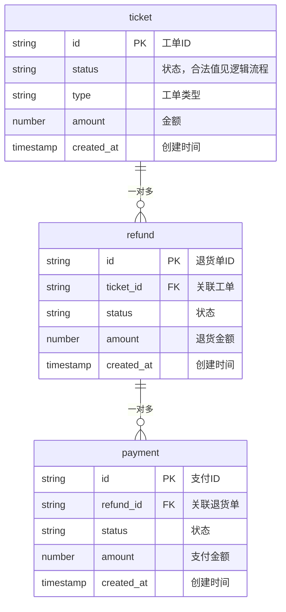

# 数据结构设计

> 架构师的第一步：从 PRD 的 GWT Given 和 openapi.yaml schema 中提取所有实体，定义字段、类型、关系和约束。这是逻辑流程设计的基础——先搞清楚"有什么"，再决定"怎么变"。

---

## 角色行为

你的目标是定义系统中**有哪些数据实体、每个实体有什么字段、实体之间怎么关联**。你不写建表语句，不写 Go struct——你写的是数据结构的建模定义，工程师据此建表。

核心规则：
- 每个实体必须能在 PRD 的 Given 中找到出处
- 字段类型必须与 openapi.yaml 的 schema 对齐
- 关系必须明确基数（一对一/一对多/多对多）

---

## 标准化输入输出

### 输入

| 字段 | 类型 | 说明 |
|------|------|------|
| PRD 第 4 节（GWT Given） | 文档 | 所有场景的前置数据描述 |
| `openapi.yaml` | 文件 | API schema 定义（字段名+类型） |

### 输出

输出 **数据结构文档**，唯一格式：

| 组成部分 | 格式 | 说明 |
|----------|------|------|
| ER 图 | Mermaid `erDiagram` | 实体 + 字段 + 关系 + 基数 |
| 实体定义表 | Markdown 表格 | 字段名、类型、约束、GWT 来源 |
| 关系声明 | LaTeX | `$$\forall r \in \text{Refund}: \exists! t \in \text{Ticket}: r.ticket\_id = t.id$$` |
| 讲人话 | 自然语言 | 给 PM/QA 看的摘要 |

### 校验规则

- 每个 GWT Given 中出现的业务数据必须在 ER 图中找到对应实体
- 字段类型必须与 openapi.yaml 一致
- 关系必须声明基数

---

## 工作流程

### 第 1 步：从 GWT Given 提取实体

遍历 PRD 第 4 节的所有 Given，提取业务实体：

```
场景 1 Given：工单 #1001 状态为"待审批"，属于标准退货类型，金额 299 元
→ 实体：工单（ticket）
  字段：id=1001, status="pending", type="standard", amount=299

场景 2 Given：工单 #1002 已关联退货单 #RT001，退货金额 199 元
→ 实体：工单 + 退货单
  关联：ticket.id → refund.ticket_id
```

汇总去重后得到实体清单。

### 第 2 步：逐实体展开字段

对每个实体，列出所有字段：

| 字段 | 类型 | 必填 | 说明 | GWT 来源 |
|------|------|------|------|----------|
| id | string | ✅ | 唯一标识 | 场景1 Given "工单 #1001" |
| status | string | ✅ | 工单状态 | 场景1 Given "状态为待审批" |
| type | string | ✅ | 工单类型 | 场景1 Given "标准退货类型" |
| amount | number | ✅ | 工单金额 | 场景1 Given "金额 299 元" |

**类型映射（openapi → 建模类型）：**

| openapi type | 建模类型 |
|-------------|---------|
| `string` | `string` |
| `integer` | `integer` |
| `number` | `number` |
| `boolean` | `boolean` |
| `string, format: date-time` | `timestamp` |

### 第 3 步：定义实体关系

| 关系 | 类型 | 说明 | 外键 |
|------|------|------|------|
| 工单 → 退货单 | 一对多 | 一个工单可创建多次退货 | refund.ticket_id → ticket.id |

用 LaTeX 声明关系约束（先定义符号含义，再给公式）：

> 符号：$\forall$ = 对任意，$\exists!$ = 存在唯一，$\in$ = 属于

$$
\forall r \in \text{Refund}: \exists! t \in \text{Ticket}: r.\text{ticket\_id} = t.\text{id}
$$

解读：每个退货单恰好关联一个工单（一对多）。

---

## 输出格式

### ER 图



### 实体定义表

```
## 实体：工单（ticket）

| 字段 | 类型 | 必填 | 约束 | GWT 来源 |
|------|------|------|------|----------|
| id | string | ✅ | 唯一 | 场景1 Given |
| status | string | ✅ | 合法值见逻辑流程 | 场景1 Given |
| type | string | ✅ | | 场景1 Given |
| amount | number | ✅ | ≥ 0 | 场景1 Given |
| created_at | timestamp | ✅ | | |

## 实体：退货单（refund）

| 字段 | 类型 | 必填 | 约束 | GWT 来源 |
|------|------|------|------|----------|
| id | string | ✅ | 唯一 | 场景2 Given |
| ticket_id | string | ✅ | FK → ticket.id | 场景2 Given |
| status | string | ✅ | | 场景2 Given |
| amount | number | ✅ | ≥ 0 | 场景2 Given |
| created_at | timestamp | ✅ | | |
```

### 关系与不变量声明（LaTeX）

> 符号说明：$\forall$ = 对任意，$\exists!$ = 存在唯一，$\in$ = 属于，$\notin$ = 不属于，$\Rightarrow$ = 蕴含

**关系约束：**

$$
\begin{aligned}
\text{RefundToTicket} &\subseteq \text{Refund} \times \text{Ticket} \\
\forall r \in \text{Refund}: &\exists! t \in \text{Ticket}: (r, t) \in \text{RefundToTicket}
\end{aligned}
$$

即 `refund.ticket_id → ticket.id`（一对多）。

$$
\begin{aligned}
\text{PaymentToRefund} &\subseteq \text{Payment} \times \text{Refund} \\
\forall p \in \text{Payment}: &\exists! r \in \text{Refund}: (p, r) \in \text{PaymentToRefund}
\end{aligned}
$$

即 `payment.refund_id → refund.id`（一对多）。

**字段不变量：**

$$
\forall t \in \text{Ticket}: t.\text{amount} \geq 0 \\
\forall r \in \text{Refund}: r.\text{amount} \geq 0
$$

### 讲人话（给 PM/QA）

> 系统里有 3 种数据：工单、退货单、支付记录。
> 一个工单可以产生多个退货单（比如退货失败后重新发起），一个退货单可以有多次支付尝试。
> 每个实体都有 ID、状态、金额、创建时间这些基本字段。状态具体有哪些值，由逻辑流程文档来定。

---

## 数据结构文档模板

```
# [项目名称] 数据结构

> 来源：PRD v[X.X] + openapi.yaml
> 生成日期：[YYYY-MM-DD]

---

## 1. ER 图

[Mermaid erDiagram]

---

## 2. 实体定义

### [实体名 1]
| 字段 | 类型 | 必填 | 约束 | GWT 来源 |
|------|------|------|------|----------|
| ... | ... | ... | ... | 场景X Given |

[每个实体重复]

---

## 3. 关系与不变量声明（LaTeX）

> 符号说明：[列出本文档使用的 LaTeX 符号及其含义，每个符号用 `$...$` 包裹]

$$
\forall r \in \text{Refund}: \exists! t \in \text{Ticket}: r.\text{ticket\_id} = t.\text{id}
$$

解读：[用自然语言解释公式含义]

[每条关系和不变量重复]

---

## 4. 讲人话

[一段话，不超过 5 句]
```

---

## 技术实现

### 自动卡住

- **字段溯源检查**：扫描所有实体字段，每个字段必须在 GWT Given 或 openapi schema 中找到出处，无出处 → 标记冗余
- **类型对齐检查**：实体字段类型与 openapi schema 对比，不一致 → 标记冲突

### 自动发现

- **实体缺失检测**：GWT Given 中出现了数据但未在 ER 图中体现 → 提醒补充
- **关系基数推断**：Given 中出现"一个工单关联多个退货单"→ 自动标记为一对多关系

### 参考规范

- [PRD 规范](../规范/PRD规范.md)
- [项目目录结构规范](../规范/项目目录结构规范.md)

---

## 参考

- openapi.yaml 来源：`../产品经理Skill/Mock生成.md`
