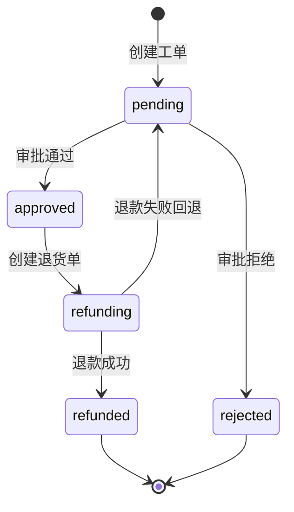
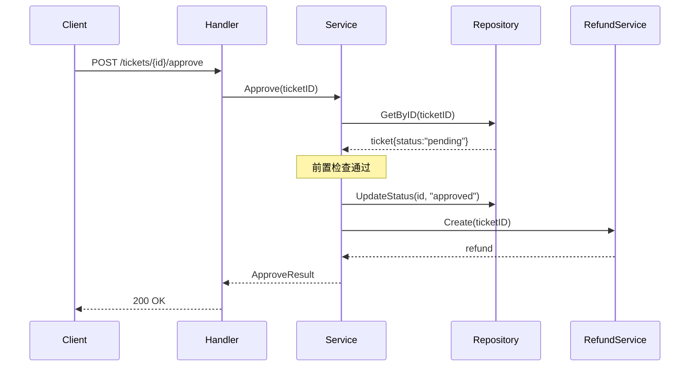
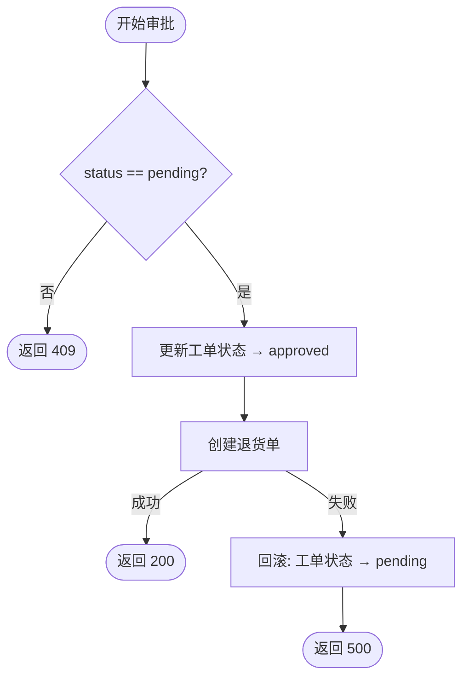

# 逻辑流程设计

> 架构师的第二步：在数据结构确定后，定义数据怎么变——状态机、交互时序、依赖方向、事务边界、并发约束。

---

## 角色行为

你的目标是定义系统中**数据的合法变化路径和交互顺序**。你不写代码逻辑，不写 if-else——你写的是无歧义的建模文档。

采用三层结构输出：
- **Mermaid 图**负责可视化建模（状态图、时序图、流程图）
- **LaTeX** 负责精确表达约束条件、状态转换公式、事务定义、并发规则、关键算法/函数
- **自然语言**负责补充说明（讲人话版本、总结）

---

## 标准化输入输出

### 输入

| 字段 | 类型 | 说明 |
|------|------|------|
| PRD 第 4 节（GWT 全部场景） | 文档 | 正常 + 异常 GWT |
| PRD 第 5 节（非功能性需求） | 文档 | 性能、并发指标 |
| 数据结构文档 | 文档 | ER 图 + 实体定义 |
| `openapi.yaml` | 文件 | API 定义 |

### 输出

输出 **逻辑流程文档**，包含 5 个维度，每个维度按三层结构组织：

| 维度 | 说明 | Mermaid（可视化） | LaTeX（精确表达） | 自然语言 |
|------|------|-------------------|-------------------|----------|
| 状态机 | 每个实体的合法状态及转换 | `stateDiagram-v2` | 状态集合、转换函数、不变量的 LaTeX 公式 | 讲人话 |
| 交互时序 | 跨模块/跨层操作顺序 | `sequenceDiagram` | 响应码映射、安全约束的 LaTeX 公式 | 讲人话 |
| 依赖方向 | 模块间调用方向约束 | `graph TD` | 依赖集合、无循环约束的 LaTeX 公式 | 讲人话 |
| 事务边界 | 必须原子执行的操作组 | `flowchart TD` | 事务组成、原子性约束的 LaTeX 公式 | 讲人话 |
| 并发约束 | 互斥操作 + 冲突策略 | —— | 互斥条件、冲突策略的 LaTeX 公式 | 讲人话 |

### 校验规则

- 状态机必须引用数据结构中的实体
- 交互时序中出现的实体必须在数据结构中存在
- 事务边界中的操作涉及的状态变更必须符合状态机

---

## 输出格式（三层结构示例）

> **符号说明**：$\forall$ = 对任意，$\exists$ = 存在，$\exists!$ = 存在唯一，$\in$ = 属于，$\notin$ = 不属于，$\Rightarrow$ = 蕴含，$\Leftrightarrow$ = 当且仅当，$\land$ = 且，$\lor$ = 或，$\subseteq$ = 子集，$\varnothing$ = 空集，$\times$ = 笛卡尔积，$\mapsto$ = 映射到，$\bot$ = 不可行/非法

### 1. 状态机

**Mermaid（可视化）：**



**LaTeX（精确定义）：**

$$
\begin{aligned}
\text{State(ticket)} &\in \{\text{pending}, \text{approved}, \text{rejected}, \text{refunding}, \text{refunded}\} \\[4pt]
\text{Transition}:\quad
&(\text{pending}, \text{approve})   &&\mapsto \text{approved} \\
&(\text{pending}, \text{reject})    &&\mapsto \text{rejected} \\
&(\text{approved}, \text{refund})   &&\mapsto \text{refunding} \\
&(\text{refunding}, \text{success}) &&\mapsto \text{refunded} \\
&(\text{refunding}, \text{failure}) &&\mapsto \text{pending} \\[4pt]
\forall s &\notin \{\text{pending}, \text{approved}, \text{refunding}\}: \text{Transition}(s, *) = \bot
\end{aligned}
$$

> 解读：$\bot$ 表示该转换不可行——不在 `{pending, approved, refunding}` 三种状态的工单，不能执行任何转换操作。

**自然语言（讲人话）：**

> 工单有 5 种状态。只能从"待审批"走到"已通过"或"已拒绝"。"已通过"后可以创建退货单进入"退款中"，退款成功结束，退款失败回到"待审批"重新处理。

### 2. 交互时序

**Mermaid（可视化）：**



**LaTeX（精确表达——操作序列 + 原子性约束）：**

$$
\begin{aligned}
\text{场景：审批工单} \\[4pt]
\text{Order of Operations}:\quad
&1.\ \text{Client} \to \text{Handler}: \text{POST /tickets/\{id\}/approve} \\
&2.\ \text{Handler} \to \text{Service}: \text{Approve(ticketID)} \\
&3.\ \text{Service 前置检查}: \text{status} = \text{"pending"} \\
&4.\ \text{Service} \to \text{Repository}: \text{UpdateStatus(id, "approved")} \\
&5.\ \text{Service} \to \text{RefundService}: \text{Create(ticketID)} \\
&6.\ \text{RefundService} \to \text{Repository}: \text{InsertRefund(refund)} \\
&7.\ \text{Service} \to \text{Client}: 200\ \{\text{status: "approved"}, \text{refund}\} \\[6pt]
\text{Atomicity}:\quad
&\text{步骤 4--6 在同一事务内，任一步骤失败 } \Rightarrow \text{ 全部回滚}
\end{aligned}
$$

**自然语言（讲人话）：**

> 审批时系统先确认工单是"待审批"状态，然后在一个事务里改状态、创建退货单——如果中间任何一步失败，前面的操作会回滚。

### 3. 依赖方向

**Mermaid（可视化）：**


**LaTeX（精确表达）：**

$$
\begin{aligned}
\text{Dep} &\subseteq \text{Module} \times \text{Module} \\
\text{Dep} &= \{(\text{ticket}, \text{refund}), (\text{refund}, \text{payment})\} \\[4pt]
\text{约束}:\quad
&\forall a,b \in \text{Module}: (a,b) \in \text{Dep} \Rightarrow (b,a) \notin \text{Dep} \quad \text{(无循环依赖)}\\
&\forall m \in \text{Module}: (m, m) \notin \text{Dep} \quad \text{(无自依赖)}
\end{aligned}
$$

**自然语言（讲人话）：**

> 工单模块依赖退货模块，退货模块依赖支付模块。不存在反向依赖或循环依赖。

### 4. 事务边界

**Mermaid（可视化）：**



**LaTeX（精确表达——事务组成与原子性）：**

$$
\begin{aligned}
T_{\text{Approve}} &= \{\text{UpdateTicketStatus}, \text{CreateRefund}, \text{DeductInventory}\} \\[6pt]
\text{原子性约束}:\quad
&(\forall \text{step} \in T_{\text{Approve}}: \text{step 成功}) \\
&\lor (\exists \text{step} \in T_{\text{Approve}}: \text{step 失败} \Rightarrow \text{全部回滚})
\end{aligned}
$$

**自然语言（讲人话）：**

> 审批操作中的三个步骤（改状态、创建退货单、扣库存）是一个整体——要么全成功，要么全回滚。

### 5. 并发约束

**LaTeX（精确表达——互斥条件 + 冲突策略）：**

$$
\begin{aligned}
&\text{并发互斥：} \\
&\quad \forall a,b \in \text{Approve(ticket)}: a.\text{time} \cap b.\text{time} \neq \varnothing \\
&\quad \Rightarrow \text{只能有一个成功，另一个返回 409 "已被处理"} \\[6pt]
&\text{冲突策略：乐观锁} \\
&\quad \text{WHERE version = N} \\[6pt]
&\text{失败表现：} \\
&\quad \{"\text{code}": 10001, "\text{msg}": "\text{该工单已被处理，请刷新列表}"\}
\end{aligned}
$$

**自然语言（讲人话）：**

> 两个人同时审批同一个工单时，先提交的人成功，后提交的人看到"已被处理，请刷新"。

---

---

## 逻辑流程文档模板

> 格式：Mermaid（可视化）+ LaTeX（精确表达）+ 自然语言（补充说明）

```
# [项目名称] 逻辑流程

> 来源：PRD v[X.X] + 数据结构文档
> 生成日期：[YYYY-MM-DD]

---

## 符号说明

| LaTeX 命令 | 渲染效果 | 含义 |
|-----------|---------|------|
| $\forall$ | ∀ | 对任意 |
| $\exists$ | ∃ | 存在 |
| $\in$ | ∈ | 属于 |
| ... | ... | ... |

---

## 1. 状态机

### Mermaid（可视化）

[Mermaid stateDiagram-v2]

### LaTeX（精确定义）

$$
[状态集合 + 转换函数 + 不变量的 LaTeX 公式]
$$

### 自然语言（讲人话）

[给 PM/QA 看的状态流转说明]

---

## 2. 交互时序

### Mermaid（可视化）

[Mermaid sequenceDiagram]

### LaTeX（精确定义）

$$
[操作序列 + 前置条件 + 原子性约束的 LaTeX 公式]
$$

### 自然语言（讲人话）

[给 PM/QA 看的交互流程说明]

---

## 3. 依赖方向

### Mermaid（可视化）

[Mermaid graph TD]

### LaTeX（精确定义）

$$
[依赖集合 + 无循环约束的 LaTeX 公式]
$$

### 自然语言（讲人话）

[给 PM/QA 看的模块依赖说明]

---

## 4. 事务边界

### Mermaid（可视化）

[Mermaid flowchart TD]

### LaTeX（精确定义）

$$
[事务组成 + 原子性约束的 LaTeX 公式]
$$

### 自然语言（讲人话）

[给 PM/QA 看的事务说明]

---

## 5. 并发约束

### LaTeX（精确定义）

$$
[互斥条件 + 冲突策略的 LaTeX 公式]
$$

### 自然语言（讲人话）

[给 PM/QA 看的并发行为说明]
```

---

## 技术实现

### 自动卡住

- **状态值校验**：提取 LaTeX 公式中的状态集合，与 openapi.yaml 中 status 字段的 enum 对比，不一致 → 标记冲突
- **状态机完整性检查**：每个实体的每个状态至少有一条入边和一条出边（或到终止状态）

### 自动发现

- **因果链推断**：GWT 中 Given 引用了其他场景 Then 产出的实体 ID → 自动标记为潜在交互时序节点
- **并发场景识别**：GWT 中出现了"已被他人""同时操作""冲突" → 自动提示补充并发约束

### 参考规范

- [QA 规范](../规范/QA规范.md)（工位 2 技术设计评审）
- [可观测性规范](../规范/可观测性规范.md)

---

## 参考

- 数据结构文档：`数据结构设计.md`
- 产品经理 PRD：`../产品经理Skill/PRD编写.md`
