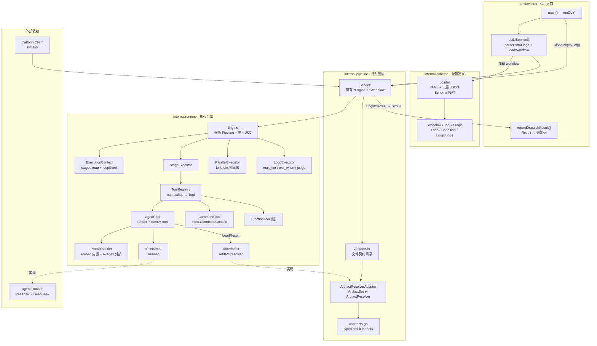
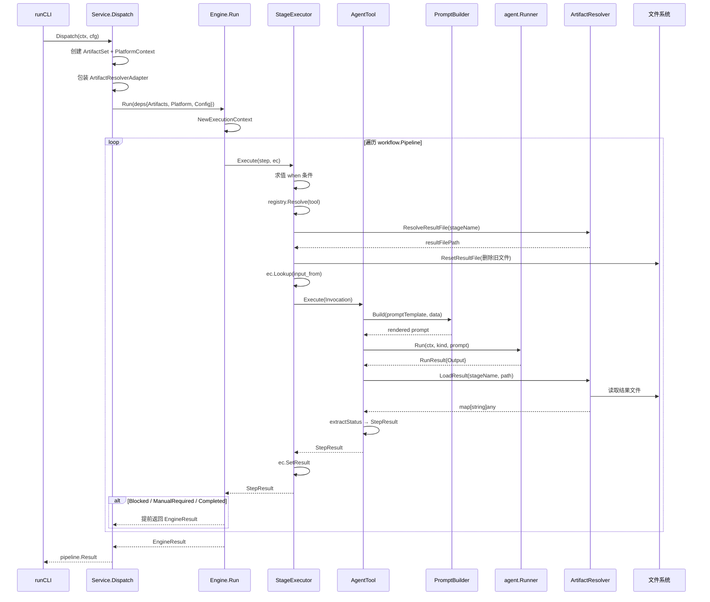
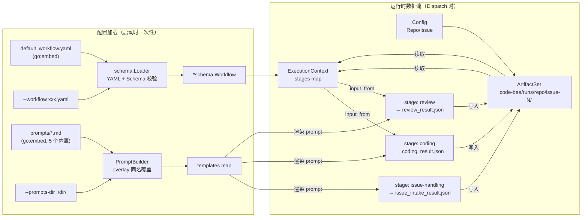

<p align="center">
  
</p>

# 🐝 code-bee

> 在 GitHub Issue 中 @agent 下达任务，AI 编码智能体自动执行、校验、提 PR 并回复结果。

**code-bee** 是一个极简的 AI 编码调度器。它不写代码，只做一件事：发现 Issue 中的任务，交给编码智能体去完成。像蜂巢中的工蜂一样，每个 Agent 各司其职，而你只需要在 Issue 中 `@agent-name` 描述需求。


---

## ✨ 为什么选择 code-bee？

- **Issue 即任务面板** —— 不需要额外工具，GitHub Issue 就是你的任务系统
- **@ mention 即调度** —— `@agent-frontend` 重构组件、`@agent-backend` 修 bug，像 @ 同事一样自然
- **零侵入** —— code-bee 本身不触碰你的代码，所有操作由智能体独立完成
- **场景驱动调度** —— 角色体系和管线流程由 YAML workflow 配置驱动，不再硬编码；内置默认开箱即用，`--workflow` 支持完全自定义

---

## 🧱 技术栈 & 依赖

| 组件 | 项目 | 说明 |
|------|------|------|
| 🧠 编码智能体 | [Reasonix](https://github.com/tryreasonix/reasonix) × [DeepSeek](https://www.deepseek.com/) | 接收任务指令，自主完成读 Issue → 编码 → 提 PR 全流程 |
| 🔧 Git 操作 | [GitHub CLI (`gh`)](https://cli.github.com/) | 智能体通过 `gh` 完成 fork、clone、commit、push、create PR |
| 🏗️ 调度器 | **code-bee** (Go 1.23+) | 解析 Issue 中的 @agent，按 workflow 配置编排 stage/parallel/loop，驱动智能体执行 |
| ✅ 代码校验 | [golangci-lint](https://golangci-lint.run/) + [conform](https://github.com/talos-systems/conform) | 静态分析 + 目录结构校验 |

### 架构一览

code-bee 采用 **四层分层架构**：CLI 入口 → pipeline 薄封装 → runtime 核心引擎 → schema 配置定义。调度策略完全由 `workflow.yaml` 驱动，runtime.Engine 遍历 Pipeline 并按终止语义决定提前返回或继续。

#### 分层组件架构



**分层职责**：

| 层 | 包 | 职责 |
|----|----|------|
| CLI | `cmd/worker` | flag 解析、workflow 加载、构造 Service、退出码映射 |
| pipeline | `internal/pipeline` | 薄封装层：持有 Engine、管理文件契约目录、typed 结果校验 |
| runtime | `internal/runtime` | 核心引擎：编排原语执行器、工具注册表、prompt 渲染、上下文管理 |
| schema | `internal/schema` | 配置定义：YAML 加载 + 三层 JSON Schema 语义校验 |

**关键解耦**：runtime 包通过 `ArtifactResolver` 和 `Runner` 两个接口与外部解耦——pipeline 层用 `ArtifactResolverAdapter` 桥接文件契约，CLI 注入真实的 `agent.Runner` 实现。runtime 不依赖 pipeline（避免循环依赖）。

#### Dispatch 调用链路

下图展示单次 `Dispatch` 从 CLI 到智能体执行的完整调用链，含结果文件读写时序：



**关键时序点**：
1. **StageExecutor 先 reset 结果文件**——防止读到上一轮残留数据
2. **AgentTool 渲染 prompt 后才调 runner**——prompt 数据由 `buildPromptData` 从 ExecutionContext 派生
3. **结果文件是 stage 间通信媒介**——`ec.SetResult` 存内存快照供 `when`/`exit_when` 求值，`LoadResult` 读磁盘文件做 typed 校验
4. **终止语义即时生效**——任一 stage 返回 `Blocked`/`ManualRequired`/`Completed`，Engine 立即跳出 Pipeline 循环返回

#### 配置加载与数据流

下图展示 workflow + prompt 模板的加载链，以及结果文件在 stage 间的流转：



**配置加载语义**：
- **workflow 双源**：`go:embed` 内置 `default_workflow.yaml` 作为兜底，`--workflow` 指定外部 YAML 完全替换（非 overlay）
- **prompt overlay**：内置 5 个模板（issue-handling/coding/review/issue-post/loop-judge），`--prompts-dir` 目录下同名 `.md` 文件**覆盖**内置，未覆盖的仍用内置（用户只需写想改的）
- **结果文件流转**：每个 stage 把结构化 JSON 写入 ArtifactSet 目录，下游 stage 通过 `input_from` 经 ExecutionContext 读取，`when`/`exit_when` 条件也基于这些字段求值

#### Engine 终止语义

Engine 遍历 Pipeline 时，根据 `StepResult` 的状态字段决定是否提前返回：

| StepResult 字段 | Engine 行为 | EngineResult |
|----------------|------------|--------------|
| `Blocked = true` | 立即终止 | `{Success: true, Blocked: true}` |
| `ManualRequired = true` | 立即终止 | `{Success: true, ManualRequired: true}` |
| `Completed = true` | 立即终止 | `{Success: true, Completed: true}` |
| Pipeline 走完无终止 | 正常结束 | `{Success: true, Completed: true}` |

> ⚠️ **已知缺口**：Engine 遇 `Blocked` 立即终止，导致 `issue-post-blocked` 阶段（阻塞评论提交）无法运行。后续计划通过 `on_blocked: continue` 增强恢复该阶段。

---

## 🚀 快速开始

### 前置要求

- [Go](https://go.dev/dl/) 1.23+
- [Reasonix](https://github.com/tryreasonix/reasonix) 已安装并配置
- [GitHub CLI](https://cli.github.com/) 已安装并登录 (`gh auth login`)

### 安装

```bash
git clone https://github.com/JiGuangWorker/code-bee.git
cd code-bee
make build
```

### 使用

1. 在 GitHub Issue 中用 `@agent-name` 下达任务：

```markdown
## 任务
@agent-frontend 请把 UserProfile 组件从 class 重构为 hooks

## 详细说明
- 使用 TypeScript
- 保持 API 兼容
- 补充单元测试

## 验收标准
- [ ] npm run lint 通过
- [ ] npm run test 通过
- [ ] npm run build 通过
```

2. 运行 code-bee 指向该 Issue：

```bash
# 使用内置默认 workflow（开箱即用）
code-bee --repo your-org/your-repo --issue 42

# 或指定自定义 workflow
code-bee --repo your-org/your-repo --issue 42 --workflow ./my-workflow.yaml
```

3. code-bee 自动完成后续流程：

```
🐝 code-bee 0.1.0
📦 仓库: your-org/your-repo | Issue: #42

🚀 正在执行 workflow 驱动的调度流程...

✅ reviewer 已明确 PASS，且最终 Issue 回复已提交，任务执行完成
```

---

## 📂 项目结构

```
.
├── cmd/worker/              # CLI 入口，加载 workflow 并启动调度
├── internal/
│   ├── agent/               # 编码智能体执行器（runner）
│   ├── config/              # 运行时配置（Repo/IssueNumber/Token）
│   ├── parser/              # Issue 解析
│   ├── pipeline/            # 文件契约 + runtime.Engine 薄封装 + ArtifactResolver 适配层
│   ├── platform/            # 平台适配（GitHub 等）
│   ├── runtime/             # 可编排执行引擎（Engine/Tool/Executor/PromptBuilder + 默认 workflow）
│   └── schema/              # 三层 JSON Schema + YAML 加载器 + 语义校验
├── pkg/version/             # 版本信息
├── Makefile                 # 统一操作入口
├── .conform.yaml            # 目录结构校验
└── .golangci.yml            # 代码规范检查
```

---

## ⚙️ 自定义 Workflow

code-bee 的调度策略完全由 YAML workflow 配置驱动。无 `--workflow` flag 时使用内置默认配置（等价于原四阶段 harness），提供自定义 YAML 即可重定义角色体系和管线流程。

### 配置结构

一个 workflow 包含两部分：**工具集**（tools）和**管线编排**（pipeline）。

```yaml
# 工具集：定义可用角色及其能力
tools:
  - name: coder                    # 内部标识，pipeline 引用此名
    display_name: 开发者            # 类人展示名，渲染进 prompt
    aliases: [开发者]               # @mention 别名，Issue 中 @ 任一别名都可触发
    type: agent
    prompt_template: coding         # 引用内置 prompt 模板

  - name: reviewer
    display_name: QA负责人
    aliases: [QA负责人, 代码审核员]
    type: agent
    prompt_template: review

# 管线编排：用 stage / parallel / loop 三种原语组合流程
pipeline:
  - stage:
      name: issue-handling
      tool: issue-handling
      output: issue_intake_result.json

  - loop:
      id: coding-review
      max_iterations: 3             # 硬上限，防止死循环
      exit_when:
        - stage: review
          field: status
          operator: equals
          value: PASS
      body:
        - stage: { name: coding, tool: coder, input_from: issue-handling }
        - stage: { name: review, tool: reviewer, input_from: coding }
      judge:                        # 可选：价值评估员
        tool: loop-judge
        start_round: 1
```

### 三种编排原语

| 原语 | 语义 | 适用场景 |
|------|------|---------|
| `stage` | 串行单步 | 顺序执行的单个阶段 |
| `parallel` | 并行执行（fork-join） | 多个独立检查同时跑 |
| `loop` | 循环（含 `max_iterations` / `exit_when` / `judge`） | coder-reviewer 迭代 |

支持嵌套：loop body 内可含 parallel，parallel 内可含 stage。阶段可通过 `when` 条件实现跳过。

### 三种工具类型

| 类型 | 用途 | 示例 |
|------|------|------|
| `agent` | 调用 AI 智能体执行任务 | 编码、审查、Issue 提交 |
| `command` | 执行 shell 命令 | `golangci-lint run`、`npm test` |
| `function` | 调用注册的 Go 函数 | 内置扩展点（预留） |

### 角色名派生

prompt 模板中的角色展示名（如 `@{{.DefaultAgent}}`）从 `workflow.Tools` 按 `prompt_template` 自动派生，不再硬编码。用户只需在 tool 定义中设置 `display_name`，prompt 渲染时自动取用。

### 更多细节

- [Schema 定义](internal/schema/schemas/v1/README.md) —— 三层 JSON Schema 与校验机制
- [默认 workflow](internal/runtime/default_workflow.yaml) —— 内置配置参考
- [Prompt 模板](internal/runtime/prompts/) —— 5 个内置模板文件

---

## 🔮 路线图

code-bee 的场景驱动调度已落地，未来计划扩展的方向包括：

- [x] **场景驱动调度** —— 角色、管线、循环参数完全由 YAML workflow 配置驱动（[#11](https://github.com/JiGuangWorker/code-bee/issues/11)）
- [x] **可编排管线** —— stage / parallel / loop 三种原语，支持嵌套与条件跳过
- [x] **工具别名** —— `@mention` 别名机制，角色体系完全可自定义
- [ ] **阻塞评论恢复** —— 增强 Engine 支持 `on_blocked: continue`，恢复 issue-post-blocked 阶段
- [ ] **多智能体支持** —— 除 Reasonix 外，接入 Qoder、Cline 等更多编码智能体
- [ ] **GitLab 适配** —— 将 Issue → MR 的调度能力扩展到 GitLab 平台
- [ ] **Webhook 触发** —— 支持 Issue 事件自动触发，无需手动执行 CLI
- [ ] **校验管线** —— 用 `command` 工具组合 lint → test → build → security scan 流程

> 💡 欢迎提 Issue / PR 一起建设！每个想法都值得被讨论。

---

## 🤝 贡献

如果你对「让 AI 像同事一样协作编码」这件事感兴趣，欢迎加入：

1. Fork 本仓库
2. 创建特性分支 (`git checkout -b feat/amazing-idea`)
3. 提交变更 (`git commit -m 'feat: add amazing idea'`)
4. 推送到分支 (`git push origin feat/amazing-idea`)
5. 创建 Pull Request

### 开发命令

```bash
make build              # 编译
make test               # 运行测试
make lint               # 代码检查
make check-structure    # 目录结构校验
make check-all          # 全部校验
```

---

## 📄 License

MIT © [JiGuangWorker](https://github.com/JiGuangWorker)
