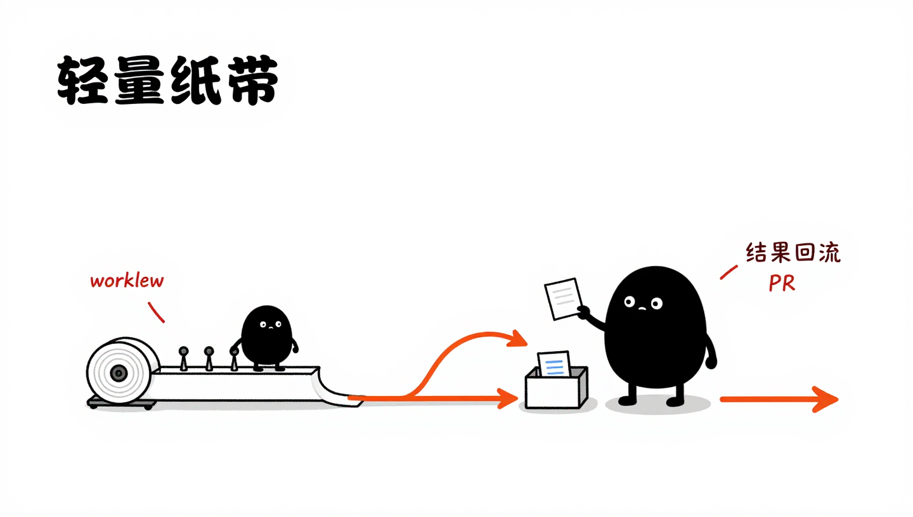

<p align="center">
  
</p>

# 🐝 code-bee

> 在 GitHub Issue 中 @agent 下达任务，AI 编码智能体自动执行、校验、提 PR 并回复结果。

**code-bee** 是一个极简的 AI 编码调度器。它不写代码，只做一件事：发现 Issue 中的任务，交给编码智能体去完成。像蜂巢中的工蜂一样，每个 Agent 各司其职，而你只需要在 Issue 中 `@agent-name` 描述需求。


---

## ✨ 为什么选择 code-bee？

- **Issue 即任务面板** —— 不需要额外工具，GitHub Issue 就是你的任务系统
- **@ mention 即调度** —— `@agent-frontend` 重构组件、`@agent-backend` 修 bug，像 @ 同事一样自然
- **零侵入** —— code-bee 本身不触碰你的代码，所有操作由智能体独立完成
- **场景驱动调度** —— 角色体系和管线流程由 YAML workflow 配置驱动，不再硬编码；内置默认开箱即用，`--workflow` 支持完全自定义

---

## 🧱 技术栈 & 依赖

| 组件 | 项目 | 说明 |
|------|------|------|
| 🧠 编码智能体 | [Reasonix](https://github.com/tryreasonix/reasonix) × [DeepSeek](https://www.deepseek.com/) | 接收任务指令，自主完成读 Issue → 编码 → 提 PR 全流程 |
| 🔧 Git 操作 | [GitHub CLI (`gh`)](https://cli.github.com/) | 智能体通过 `gh` 完成 fork、clone、commit、push、create PR |
| 🏗️ 调度器 | **code-bee** (Go 1.23+) | 解析 Issue 中的 @agent，按 workflow 配置编排 stage/parallel/loop，驱动智能体执行 |
| ✅ 代码校验 | [golangci-lint](https://golangci-lint.run/) + [conform](https://github.com/talos-systems/conform) | 静态分析 + 目录结构校验 |

### 架构一览

code-bee 现在不再强调“把系统讲成一张大架构图”，而是强调两个更重要的判断：它到底在做什么，以及它为什么要保持薄。

#### 核心思想


- **核心定位**：code-bee 是一个编排台，不是一个臃肿的编码运行时平台。
- **输入输出**：左边接住 GitHub Issue 里的 `@agent` 任务，右边只关心 PR、Issue 回复和状态结果是否闭环。
- **边界原则**：真正写代码、做审查、跑执行流程的是外部智能体与外部环境；code-bee 只负责路由、约束、校验和收口。
- **设计取舍**：宁可保持一个薄内核，也不在调度器内部堆一大堆工具能力和业务执行逻辑。

#### 设计思想



- **workflow 驱动**：调度策略由 `workflow.yaml` 决定，而不是把流程写死在代码里。
- **薄内核原语**：内核只保留 `stage / parallel / loop` 这些必要原语，用最小集合表达编排能力。
- **结果回流**：每个阶段的结构化结果会落到文件契约目录，再回流给下一阶段判断，形成可追踪的状态闭环。
- **解耦实现**：CLI 负责入口，`pipeline` 负责薄封装和结果适配，`runtime` 负责执行原语，`schema` 负责加载和校验 workflow。

#### 技术收口

| 层 | 包 | 职责 |
|----|----|------|
| CLI | `backend/cmd/worker` | flag 解析、workflow 加载、退出码映射 |
| pipeline | `backend/internal/pipeline` | 文件契约、结果校验、ArtifactResolver 适配 |
| runtime | `backend/internal/runtime` | 编排原语执行、prompt 渲染、上下文与终止语义 |
| schema | `backend/internal/schema` | YAML 加载、Schema 校验、workflow 结构定义 |

**更多细节**：

- [Schema 定义](backend/internal/schema/schemas/v1/README.md) —— workflow 的结构与校验规范
- [默认 workflow](backend/internal/runtime/default_workflow.yaml) —— 内置调度配置参考
- [Prompt 模板](backend/internal/runtime/prompts/) —— 默认提示词模板
- [YAML 编辑器文档](docs/design/orchestration-yaml-schema-from-source.md) —— 编排 YAML 的来源与结构说明

---

## 🚀 快速开始

### 前置要求

- [Go](https://go.dev/dl/) 1.23+
- [Reasonix](https://github.com/tryreasonix/reasonix) 已安装并配置
- [GitHub CLI](https://cli.github.com/) 已安装并登录 (`gh auth login`)

### 安装

```bash
git clone https://github.com/JiGuangWorker/code-bee.git
cd code-bee
make build
```

### 使用

1. 在 GitHub Issue 中用 `@agent-name` 下达任务：

```markdown
## 任务
@agent-frontend 请把 UserProfile 组件从 class 重构为 hooks

## 详细说明
- 使用 TypeScript
- 保持 API 兼容
- 补充单元测试

## 验收标准
- [ ] npm run lint 通过
- [ ] npm run test 通过
- [ ] npm run build 通过
```

2. 运行 code-bee 指向该 Issue：

```bash
# 使用内置默认 workflow（开箱即用）
code-bee --repo your-org/your-repo --issue 42

# 或指定自定义 workflow
code-bee --repo your-org/your-repo --issue 42 --workflow ./my-workflow.yaml
```

3. code-bee 自动完成后续流程：

```
🐝 code-bee 0.1.0
📦 仓库: your-org/your-repo | Issue: #42

🚀 正在执行 workflow 驱动的调度流程...

✅ reviewer 已明确 PASS，且最终 Issue 回复已提交，任务执行完成
```

---

## 📂 项目结构

```
.
├── backend/             # Go 后端工程
│   ├── cmd/worker/      # CLI 入口
│   ├── internal/        # 私有代码（agent/config/editor/parser/pipeline/platform/runtime/schema）
│   ├── pkg/version/     # 版本信息
│   ├── go.mod
│   └── go.sum
├── frontend/            # React 前端工程（预留）
├── deploy/              # 部署资产（预留）
├── docs/                # 项目文档与设计图
├── .skills/             # 智能体技能资产
├── Makefile             # 仓库级统一操作入口
├── .conform.yaml        # 目录结构校验
└── .golangci.yml        # Go 代码规范检查
```

---

## ⚙️ 自定义 Workflow

code-bee 的调度策略完全由 YAML workflow 配置驱动。无 `--workflow` flag 时使用内置默认配置（等价于原四阶段 harness），提供自定义 YAML 即可重定义角色体系和管线流程。

### 配置结构

一个 workflow 包含两部分：**工具集**（tools）和**管线编排**（pipeline）。

```yaml
# 工具集：定义可用角色及其能力
tools:
  - name: coder                    # 内部标识，pipeline 引用此名
    display_name: 开发者            # 类人展示名，渲染进 prompt
    aliases: [开发者]               # @mention 别名，Issue 中 @ 任一别名都可触发
    type: agent
    prompt_template: coding         # 引用内置 prompt 模板

  - name: reviewer
    display_name: QA负责人
    aliases: [QA负责人, 代码审核员]
    type: agent
    prompt_template: review

# 管线编排：用 stage / parallel / loop 三种原语组合流程
pipeline:
  - stage:
      name: issue-handling
      tool: issue-handling
      output: issue_intake_result.json

  - loop:
      id: coding-review
      max_iterations: 3             # 硬上限，防止死循环
      exit_when:
        - stage: review
          field: status
          operator: equals
          value: PASS
      body:
        - stage: { name: coding, tool: coder, input_from: issue-handling }
        - stage: { name: review, tool: reviewer, input_from: coding }
      judge:                        # 可选：价值评估员
        tool: loop-judge
        start_round: 1
```

### 三种编排原语

| 原语 | 语义 | 适用场景 |
|------|------|---------|
| `stage` | 串行单步 | 顺序执行的单个阶段 |
| `parallel` | 并行执行（fork-join） | 多个独立检查同时跑 |
| `loop` | 循环（含 `max_iterations` / `exit_when` / `judge`） | coder-reviewer 迭代 |

支持嵌套：loop body 内可含 parallel，parallel 内可含 stage。阶段可通过 `when` 条件实现跳过。

### 三种工具类型

| 类型 | 用途 | 示例 |
|------|------|------|
| `agent` | 调用 AI 智能体执行任务 | 编码、审查、Issue 提交 |
| `command` | 执行 shell 命令 | `golangci-lint run`、`npm test` |
| `function` | 调用注册的 Go 函数 | 内置扩展点（预留） |

### 角色名派生

prompt 模板中的角色展示名（如 `@{{.DefaultAgent}}`）从 `workflow.Tools` 按 `prompt_template` 自动派生，不再硬编码。用户只需在 tool 定义中设置 `display_name`，prompt 渲染时自动取用。

### 更多细节

- [Schema 定义](backend/internal/schema/schemas/v1/README.md) —— 三层 JSON Schema 与校验机制
- [默认 workflow](backend/internal/runtime/default_workflow.yaml) —— 内置配置参考
- [Prompt 模板](backend/internal/runtime/prompts/) —— 5 个内置模板文件

---

## 🔮 路线图

code-bee 的场景驱动调度已落地，未来计划扩展的方向包括：

- [x] **场景驱动调度** —— 角色、管线、循环参数完全由 YAML workflow 配置驱动（[#11](https://github.com/JiGuangWorker/code-bee/issues/11)）
- [x] **可编排管线** —— stage / parallel / loop 三种原语，支持嵌套与条件跳过
- [x] **工具别名** —— `@mention` 别名机制，角色体系完全可自定义
- [ ] **阻塞评论恢复** —— 增强 Engine 支持 `on_blocked: continue`，恢复 issue-post-blocked 阶段
- [ ] **多智能体支持** —— 除 Reasonix 外，接入 Qoder、Cline 等更多编码智能体
- [ ] **GitLab 适配** —— 将 Issue → MR 的调度能力扩展到 GitLab 平台
- [ ] **Webhook 触发** —— 支持 Issue 事件自动触发，无需手动执行 CLI
- [ ] **校验管线** —— 用 `command` 工具组合 lint → test → build → security scan 流程

> 💡 欢迎提 Issue / PR 一起建设！每个想法都值得被讨论。

---

## 🤝 贡献

如果你对「让 AI 像同事一样协作编码」这件事感兴趣，欢迎加入：

1. Fork 本仓库
2. 创建特性分支 (`git checkout -b feat/amazing-idea`)
3. 提交变更 (`git commit -m 'feat: add amazing idea'`)
4. 推送到分支 (`git push origin feat/amazing-idea`)
5. 创建 Pull Request

### 开发命令

```bash
make build                 # 编译后端二进制
make test-backend-unit     # 后端单元测试
make test-backend-race     # 后端 race 测试
make lint-backend          # 后端代码检查
make check-structure       # 目录结构校验
make check-commits         # 提交信息校验
make check-all             # 提交前静态门禁
make release-check         # 发布前总校验
```

---

## 📄 License

MIT © [JiGuangWorker](https://github.com/JiGuangWorker)
